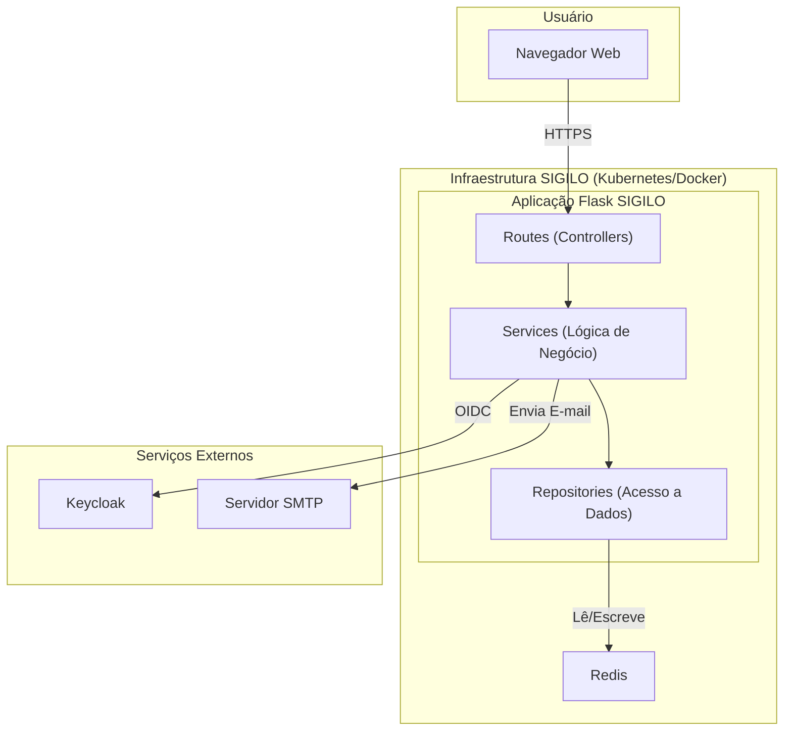

# Diagrama de Arquitetura (Componentes)

Este diagrama mostra os principais componentes da aplicação e como eles interagem entre si, destacando a nova arquitetura em camadas.

```mermaid
graph TD
    subgraph "Usuário"
        Browser[Navegador Web]
    end

    subgraph "Infraestrutura SIGILO (Kubernetes/Docker)"
        subgraph "Aplicação Flask SIGILO"
            direction LR
            Routes["Routes (Controllers)"]
            Services["Services (Lógica de Negócio)"]
            Repositories["Repositories (Acesso a Dados)"]
            
            Routes --> Services
            Services --> Repositories
        end
        Redis[Redis]
        Repositories -- Lê/Escreve --> Redis
    end

    subgraph "Serviços Externos"
        Keycloak[Keycloak]
        SMTPServer["Servidor SMTP"]
    end

    Browser -- HTTPS --> Routes
    Services -- OIDC --> Keycloak
    Services -- Envia E-mail --> SMTPServer
```
