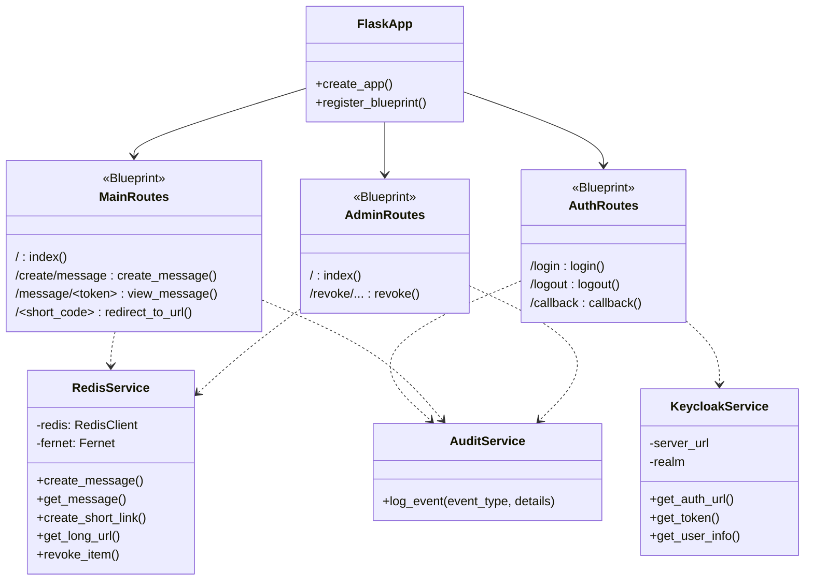

# Diagrama de Classes (Simplificado)

Este diagrama mostra as principais classes de serviço e rotas da aplicação, destacando suas responsabilidades.

```mermaid
classDiagram
    class FlaskApp {
        +create_app()
        +register_blueprint()
    }

    class RedisService {
        -redis: RedisClient
        -fernet: Fernet
        +create_message()
        +get_message()
        +create_short_link()
        +get_long_url()
        +revoke_item()
    }

    class KeycloakService {
        -server_url
        -realm
        +get_auth_url()
        +get_token()
        +get_user_info()
    }

    class AuditService {
        +log_event(event_type, details)
    }

    class MainRoutes {
        <<Blueprint>>
        / : index()
        /create/message : create_message()
        /message/&lt;token&gt; : view_message()
        /&lt;short_code&gt; : redirect_to_url()
    }

    class AuthRoutes {
        <<Blueprint>>
        /login : login()
        /logout : logout()
        /callback : callback()
    }
    
    class AdminRoutes {
        <<Blueprint>>
        / : index()
        /revoke/... : revoke()
    }

    FlaskApp --> MainRoutes
    FlaskApp --> AuthRoutes
    FlaskApp --> AdminRoutes
    
    MainRoutes ..> RedisService
    AuthRoutes ..> KeycloakService
    AdminRoutes ..> RedisService

    AuthRoutes ..> AuditService
    MainRoutes ..> AuditService
    AdminRoutes ..> AuditService
```
