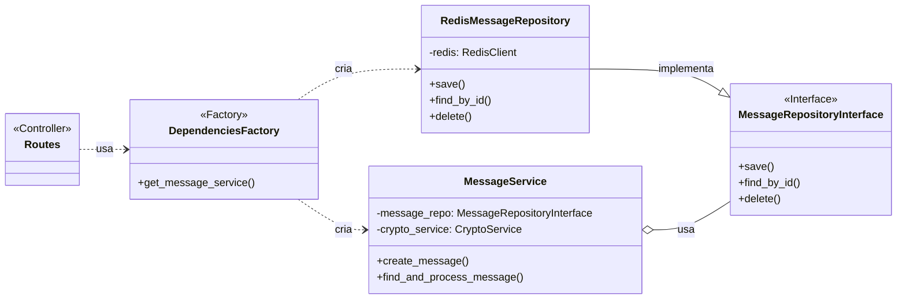

# Diagrama de Classes (Simplificado)

Este diagrama mostra a relação entre as Interfaces, Repositórios e Serviços, ilustrando o padrão de Inversão de Dependência.

```mermaid
classDiagram
    direction LR

    class MessageRepositoryInterface {
        <<Interface>>
        +save()
        +find_by_id()
        +delete()
    }

    class RedisMessageRepository {
        -redis: RedisClient
        +save()
        +find_by_id()
        +delete()
    }

    class MessageService {
        -message_repo: MessageRepositoryInterface
        -crypto_service: CryptoService
        +create_message()
        +find_and_process_message()
    }
    
    class DependenciesFactory {
        <<Factory>>
        +get_message_service()
    }

    class Routes {
        <<Controller>>
    }

    RedisMessageRepository --|> MessageRepositoryInterface : implementa
    MessageService o-- MessageRepositoryInterface : usa
    DependenciesFactory ..> MessageService : cria
    DependenciesFactory ..> RedisMessageRepository : cria
    Routes ..> DependenciesFactory : usa

```