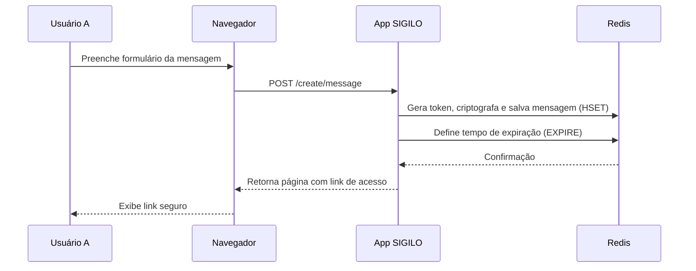

# Diagrama de Fluxo (Criação e Acesso de Mensagem)

Este diagrama de sequência descreve o fluxo de interações para o caso de uso principal: um usuário criando e outro acessando uma mensagem segura.

### Criação da Mensagem



### Acesso à Mensagem

```mermaid
sequenceDiagram
    participant UserB as Usuário B
    participant Browser as Navegador
    participant SIGILO as App SIGILO
    participant Redis

    UserB->>Browser: Acessa URL com token
    Browser->>SIGILO: GET /message/&lt;token&gt;
    SIGILO->>Redis: Incrementa visitas (HINCRBY) e busca dados
    Redis-->>SIGILO: Retorna dados da mensagem
    alt Mensagem válida
        SIGILO->>SIGILO: Descriptografa conteúdo
        SIGILO-->>Browser: Renderiza página com a mensagem
        Browser-->>UserB: Exibe mensagem
        SIGILO->>Redis: Se limite de visitas foi atingido, apaga a chave (DEL)
    else Mensagem inválida ou expirada
        SIGILO-->>Browser: Renderiza página de erro
        Browser-->>UserB: Exibe erro
    end
```
