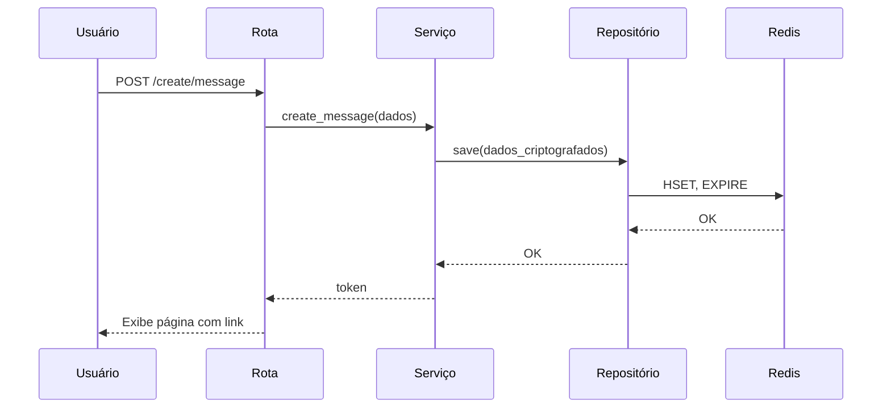
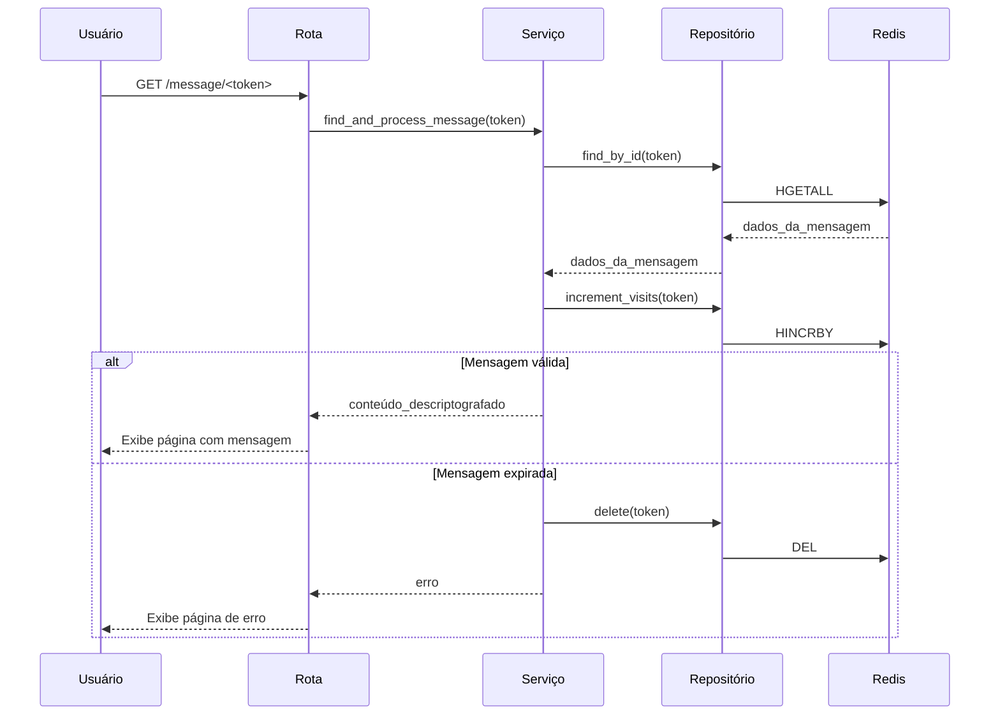

# Diagrama de Fluxo (Criação e Acesso de Mensagem)

Este diagrama de sequência foi atualizado para mostrar a interação entre as novas camadas da arquitetura (Serviço e Repositório).

### Criação da Mensagem

### Acesso à Mensagem

